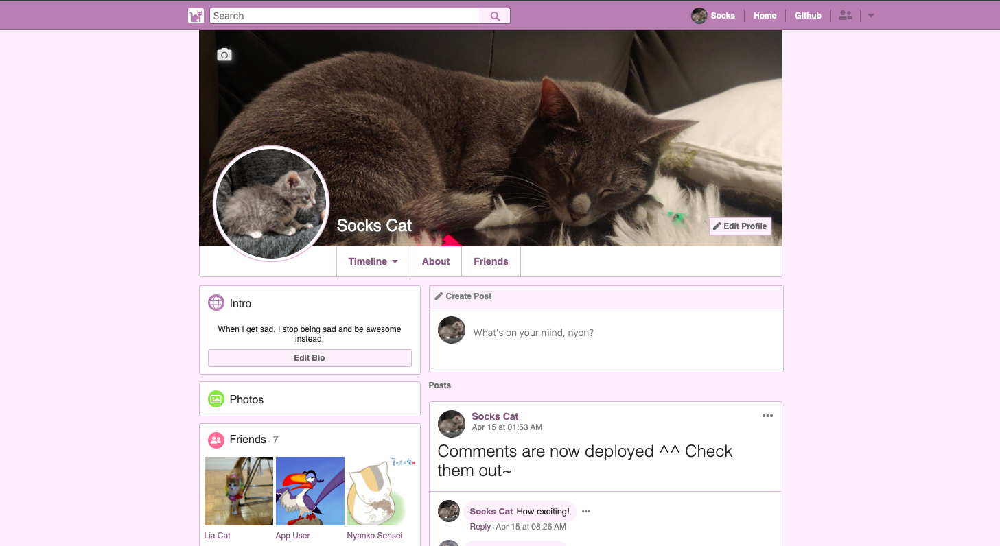
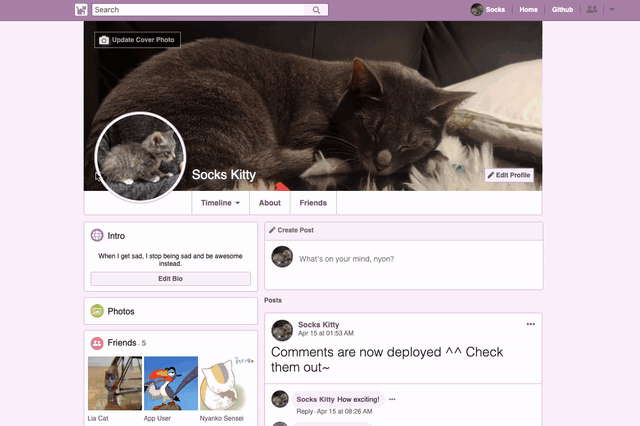
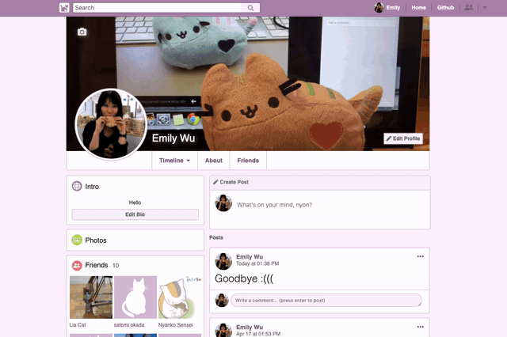
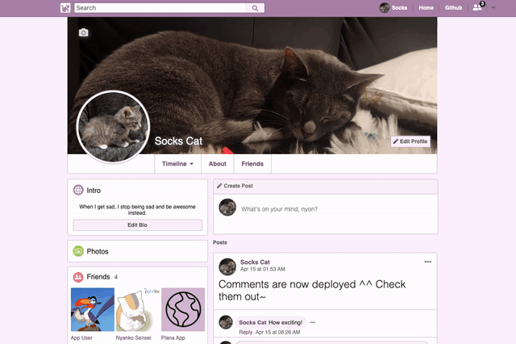
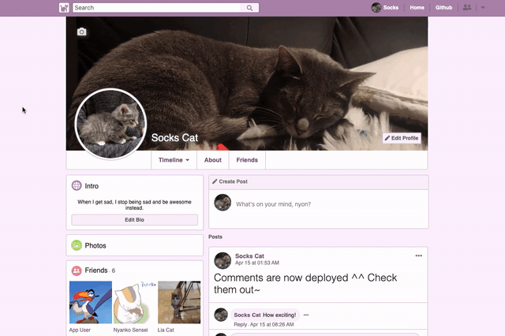
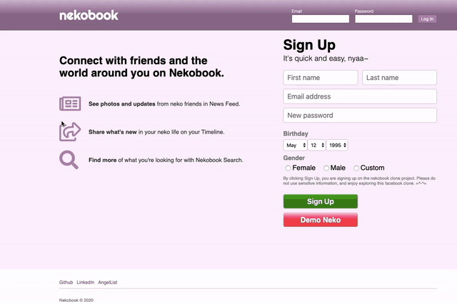
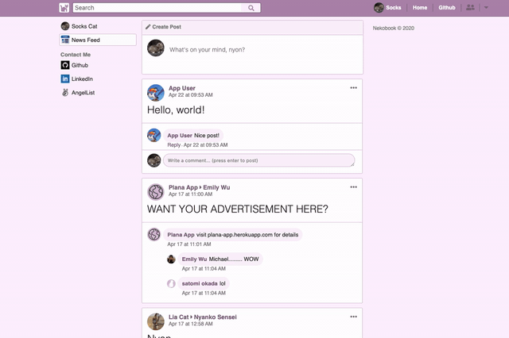

# Nekobook
A web application that lets nekos connect with other nekos.

[Nekobook](https://nekobook.herokuapp.com) is a cute web application that lets nekos connect with other nekos. The app is a mini-clone of the popular social media site [Facebook](https://facebook.com).

[](https://nekobook.herokuapp.com/)
[](https://github.com/RichardLitt/standard-readme)


## Table of Contents

- [Technologies Used](#technology)
- [Key Features](#features)
    - [Neko Profiles](#profiles)
    - [Neko Friends](#friending)
    - [Neko Newsfeed](#newsfeed)
- [Code Snippets](#snippets)
- [Maintainers](#maintainers)
- [License](#license)

## Technology

This fullstack project was built through utilizing the following technologies:
* [Ruby on Rails](https://api.rubyonrails.org/)
* [Redux](https://redux.js.org/api/api-reference)
* [React](https://reactjs.org/docs/getting-started.html)
* [PostgreSQL](https://www.postgresql.org/)
* [AWS S3](https://docs.aws.amazon.com/s3/index.html)
* [Heroku](https://devcenter.heroku.com/categories/reference)

## Features

The hallmark Nekobook features highlighted in this section are:
1. [Neko Profiles](#profiles)
2. [Neko Friends](#friending)
3. [Neko Newsfeed](#newsfeed)

The following additional functionalities have also been implemented: user authentication and error handling, creation/deletion/modification of posts and comments (backbone to profile timeline and newsfeed), and neko friend search.

### Profiles
Each registered user has their own profile page, on which they can do the following:
- Update their profile picture and cover photo, and edit their 'Bio' and 'About' information


- View their and other users' friends list on both the 'Timeline' and the 'Friends' pages of the respective user



- Create/update/delete their own posts/comments (either on their own wall or their friends' walls), or delete any posts/comments on their own wall


### Friending
Users can establish friendships, which enables them to post/comment on each others' walls. Specifically, the following have been implemented for friending:
- Send/cancel outgoing friend requests through different avenues (e.g., navbar search results, profile page)



- Confirm/delete incoming friend requests through different avenues (e.g., notifications, navbar search results, profile page)



- Remove existing friends through different avenues (e.g., navbar search results, profile page)



### Newsfeed
Users can see their and their friends' posts through the newsfeed feature, which appears upon logging onto Nekobook. The following actions are available:
- Create/update/delete one's own posts/comments on the newsfeed


- Hide/unhide one's own/one's friend's posts from appearing on the newsfeed


## Snippets

```
```

## Maintainers

[@emikyu](https://github.com/emikyu)


## License

© 2020 Emily Wu
