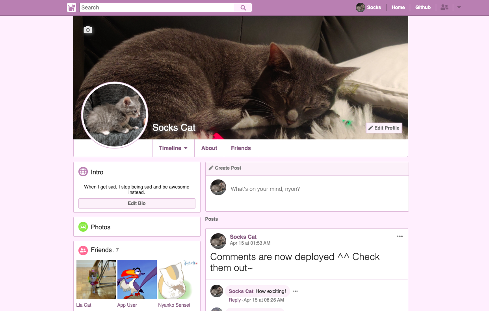

# Nekobook
A web application that lets nekos connect with other nekos.

[Nekobook](https://nekobook.herokuapp.com) is a cute web application that lets nekos connect with other nekos. The app is a mini-clone of the popular social media site [Facebook](https://facebook.com).

[](https://nekobook.herokuapp.com/)
[](https://github.com/RichardLitt/standard-readme)


## Table of Contents

- [Technologies Used](#technology)
- [Key Features](#features)
    - [Neko Profiles](#profiles)
    - [Neko Friends](#friending)
    - [Neko Newsfeed](#newsfeed)
- [Code Snippets](#snippets)
- [Maintainers](#maintainers)
- [License](#license)
- [Design Documents](https://github.com/emikyu/Nekobook/wiki)

## Technology

This fullstack project utilizes the following technologies: [Ruby on Rails](https://api.rubyonrails.org/), [Redux](https://redux.js.org/api/api-reference), [React](https://reactjs.org/docs/getting-started.html), [PostgreSQL](https://www.postgresql.org/), [AWS S3](https://docs.aws.amazon.com/s3/index.html), and [Heroku](https://devcenter.heroku.com/categories/reference)

## Features

The hallmark Nekobook features highlighted in this section are:
1. [Neko Profiles](#profiles)
2. [Neko Friends](#friending)
3. [Neko Newsfeed](#newsfeed)

The following additional functionalities have also been implemented: user authentication and error handling, creation/deletion/modification of posts and comments (backbone to profile timeline and newsfeed), and neko friend search.

### Profiles
Each registered user has their own profile page, on which they can do the following:
- Update their profile picture and cover photo, and edit their 'Bio' and 'About' information


- View their and other users' friends list on both the 'Timeline' and the 'Friends' pages of the respective user


- Create/update/delete their own posts/comments (either on their own wall or their friends' walls), or delete any posts/comments on their own wall


### Friending
Users can establish friendships, which enables them to post/comment on each others' walls. Specifically, the following have been implemented for friending:
- Send/cancel outgoing friend requests through different avenues (e.g., navbar search results, profile page)


- Confirm/delete incoming friend requests through different avenues (e.g., notifications, navbar search results, profile page)


- Remove existing friends through different avenues (e.g., navbar search results, profile page)


### Newsfeed
Users can see their and their friends' posts through the newsfeed feature, which appears upon logging onto Nekobook. The following actions are available:
- Create/update/delete one's own posts/comments on the newsfeed


- Hide/unhide one's own/one's friend's posts from appearing on the newsfeed


## Snippets

Although seemingly small in terms of pixel real estate taken, the friend requesting feature is prevalent throughout different places within the application (e.g., timeline nav, timeline 'Friends' page, and user search results page). Specifically, the friend request button enables users to manage their existing friendships, accept/decline incoming requests, and send/cancel outgoing requests. 

Furthermore, the button and its hover dropdown changes its state depending on the relationship between the current user and the user being viewed: same user, already friends, pending outgoing request, pending incoming request, and no pending requests & not already friends. The following code helps to determine which button and dropdown items ultimately become rendered.


```javascript
let buttonText = (<><i className="fas fa-user-plus"></i> Add Friend</>);
let buttonClick = () => makeFriendRequest(currentUserId, showNekoId);
let listTexts = [];
let handleClicks = [];

// if on own profile - allow edit profile && unhide self
if (showNekoId === currentUserId) {
    buttonText = (<><i className="fas fa-pen"></i> Edit Profile</>);
    buttonClick = () => this.props.history.push(`/nekos/${currentUserId}/about`);
    if (isHidden) {
        listTexts = ["Unhide"];
        handleClicks = [() => toUnhide(currentUserId, hidden_friends)];
    }
} 
// if already friends with shown user & hidden from newsfeed - allow unfriending and unhide
else if (friendIds.includes(showNekoId) && isHidden) {
    buttonText = (<><i className="fas fa-check"></i> Friends <i className="fas fa-caret-down"></i></>);
    buttonClick = null;
    listTexts = ["Unhide", "Unfriend"];
    handleClicks = [() => toUnhide(currentUserId, hidden_friends), () => toUnfriend(currentUserId, showNekoId)];
// if already friends with shown user - allow unfriending
} else if (friendIds.includes(showNekoId)) {
    buttonText = (<><i className="fas fa-check"></i> Friends <i className="fas fa-caret-down"></i></>);
    buttonClick = null;
    listTexts = ["Unfriend"];
    handleClicks = [() => toUnfriend(currentUserId, showNekoId)];
}
// if have incoming friend request from user - either confirm (friend) or delete request (reject request)
else if (requesterIds.includes(showNekoId)) {
    buttonText = (<><i className="fas fa-user-plus"></i> Respond to Friend Request</>);
    buttonClick = null;
    listTexts = ["Confirm", "Delete Request"];
    handleClicks = [() => toFriend(currentUserId, showNekoId),
                    () => removeFriendRequest(showNekoId, currentUserId)];
}
// if have pending outgoing request to user - can cancel request
else if (requesteeIds.includes(showNekoId)) {
    buttonText = (<><i className="fas fa-user-plus"></i> Friend Request Sent</>);
    buttonClick = null;
    listTexts = ["Cancel Request"];
    handleClicks = [() => removeFriendRequest(currentUserId, showNekoId)];
        }
```

The ```FriendRequestButton``` container is set up to provide the button component with the shown user's Id and the current user's Id, as well as enable fetching of the relevant users' information to identify their current relationship via the application state.

Once ```buttonText``` (text displayed on button), ```buttonClick``` (click event handler for button itself, if applicable), ```listTexts``` (hover dropdown items), and ```handleClicks``` (click event handlers for dropdown items) are set, the following universal code is used to display the actual button.

```javascript
return (
    <div className="friend-request-button-container">
        <button onClick={buttonClick}>
            {buttonText}
        </button>
        {listTexts.length > 0 ? (<>
        <div className="tooltip"></div>
        <div className="tooltip-border"></div>
        <div className="invisible-border">
            <div>
            </div>
            <div>
                <ul>
                    {
                        listTexts.map((listText, idx) => (
                            <li key={listText} onClick={handleClicks[idx]}>
                                {listText}
                            </li>
                        ))
                    }
                </ul>
            </div>
        </div></>
        ) : ("")}
    </div>
)
```

## Maintainers

[@emikyu](https://github.com/emikyu)


## License

© 2020 Emily Wu

## Design Documents

[Design Documents](https://github.com/emikyu/Nekobook/wiki)
