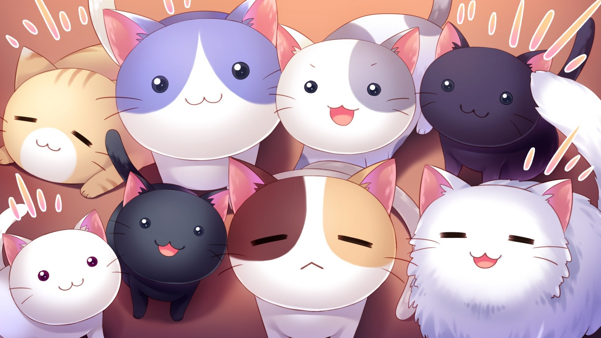

# Nekobook

[](https://nekobook.herokuapp.com/)
[](https://github.com/RichardLitt/standard-readme)


A web application that lets nekos connect with other nekos.

[Nekobook](https://nekobook.herokuapp.com) is a cute web application that lets nekos connect with other nekos. The app is a mini-clone of the popular social media site [Facebook](https://facebook.com).

## Table of Contents

- [Key Features](#features)
    - [Neko Profiles](#profiles)
    - [Neko Friends](#friending)
    - [Posts and Comments](#posting)
- [Technologies Used](#technology)
- [Code Snippets](#snippets)
- [Maintainers](#maintainers)
- [Contributing](#contributing)
- [License](#license)

## Features

### Profiles

### Friending

### Posting

## Technology

```
```

## Snippets

```
```

## Maintainers

[@nekobook](https://github.com/nekobook)

## Contributing


Small note: If editing the README, please conform to the [standard-readme](https://github.com/RichardLitt/standard-readme) specification.

## License

n/a © 2020 Emily Wu
